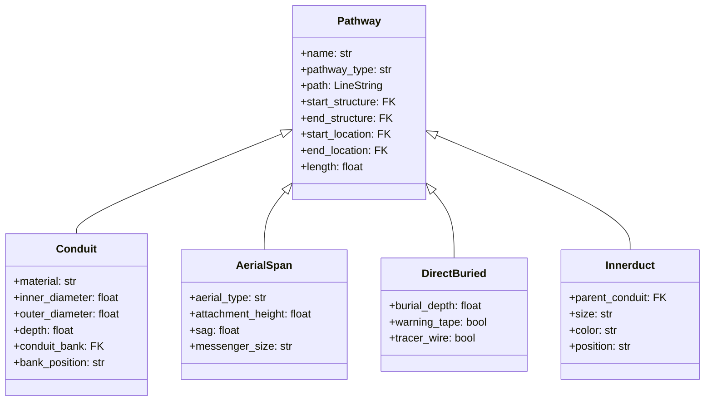

# Architecture

This page describes the internal architecture of NetBox Pathways for developers extending or contributing to the plugin.

## Project Structure

```
netbox_pathways/
├── __init__.py              # PluginConfig
├── models.py                # All Django models
├── choices.py               # ChoiceSet classes
├── registry.py              # Map layer registry (cross-plugin integration)
├── geo.py                   # SRID helpers
├── search.py                # Global search indexes
├── navigation.py            # Plugin menu items
├── admin.py                 # Django admin registrations
├── forms.py                 # NetBox forms (model + filter)
├── tables.py                # NetBox table classes
├── filtersets.py             # Django filter sets
├── views.py                 # View classes (list, detail, edit, delete, map)
├── urls.py                  # URL routing
├── api/
│   ├── urls.py              # API URL routing (REST + GeoJSON)
│   ├── views.py             # DRF ViewSets
│   ├── serializers.py       # DRF serializers
│   ├── geo.py               # GeoJSON ViewSets + serializers
│   ├── external_geo.py      # External layer GeoJSON endpoint
│   └── traversal.py         # Graph traversal endpoints
├── ui/
│   └── panels.py            # NetBox 4.5 layout panels
├── templates/
│   └── netbox_pathways/
│       ├── map.html          # Interactive map template
│       └── ...               # Detail/form templates
├── static/
│   └── netbox_pathways/
│       ├── src/              # TypeScript source
│       │   ├── pathways-map.ts
│       │   ├── sidebar.ts
│       │   ├── popover.ts
│       │   ├── detail-map.ts
│       │   ├── external-layers.ts
│       │   └── types/
│       ├── dist/             # Built JS bundles (gitignored)
│       ├── css/
│       ├── vendor/           # Leaflet, MarkerCluster
│       └── qgis/             # QGIS style files
└── management/
    └── commands/
        └── generate_qgis_project.py
```

## Data Model

### Multi-Table Inheritance

Pathways use Django's multi-table inheritance. The `Pathway` base model holds shared fields (name, path geometry, endpoints, tenant), and each subtype adds its own table with specialized fields.



The `pathway_type` field is automatically set in `save()` based on the child class.

### Geographic Fields

All geographic fields use PostGIS via `django.contrib.gis`:

| Model | Field | Geometry Type |
|-------|-------|---------------|
| Structure | `location` | Point or Polygon |
| Pathway | `path` | LineString |
| SiteGeometry | `geometry` | Point or Polygon |
| CableSegment | `enter_point`, `exit_point`, `slack_loop_location` | Point |

The SRID is configured in `geo.py` and used consistently across all models and API responses.

## View System

Views use the NetBox 4.5 layout system:

- **List views** — Standard `generic.ObjectListView` with custom tables and filter sets
- **Detail views** — `SimpleLayout` with `ObjectAttributesPanel` subclasses defined in `ui/panels.py`
- **Edit views** — `generic.ObjectEditView` with model forms
- **Map view** — Custom view serving the Leaflet map template with JSON configuration

## REST API

### Standard Endpoints

DRF ViewSets registered via `NetBoxRouter` at `/api/plugins/pathways/`:

- CRUD for all models (structures, conduits, aerial-spans, etc.)
- Standard NetBox filtering, pagination, and permissions

### GeoJSON Endpoints

Read-only GeoJSON FeatureCollections at `/api/plugins/pathways/geo/`:

- `geo/structures/` — Point features
- `geo/pathways/` — LineString features
- `geo/conduits/`, `geo/aerial-spans/`, `geo/direct-buried/` — Type-specific
- `geo/external/<layer_name>/` — External plugin layers (reference mode)

### Traversal Endpoints

Graph traversal at `/api/plugins/pathways/traversal/`:

- `routes/` — Route finding between structures
- `cable-trace/` — Cable trace through pathways
- `neighbors/` — Adjacent structure discovery

## Frontend Architecture

### TypeScript + esbuild

Source files in `src/` are TypeScript, compiled to minified IIFE bundles in `dist/` via esbuild. The build targets ES2016 for broad browser support.

Key modules:

| Module | Purpose |
|--------|---------|
| `pathways-map.ts` | Main map initialization, data loading, layer management |
| `sidebar.ts` | Sidebar list/detail panels, search, type filters |
| `popover.ts` | Hover popover tooltips |
| `detail-map.ts` | Detail page mini-maps |
| `external-layers.ts` | External plugin layer fetch/render |
| `point-polygon-widget.ts` | Map widget for geometry input on forms |

Leaflet is loaded externally (vendor bundle), not bundled.

### Build Commands

```bash
cd netbox_pathways/static/netbox_pathways
npm install          # Install build dependencies
npm run build        # Build production bundles
npm run watch        # Watch mode for development
npm run typecheck    # TypeScript type checking only
```

## Map Layer Registry

The registry system allows external plugins to add layers to the Pathways map. See the dedicated [Map Layer Registry](map-layer-registry.md) guide.

## Search Integration

All models are indexed for NetBox global search via `@register_search` decorators in `search.py`. Search fields include name, comments, and key attributes per model.
