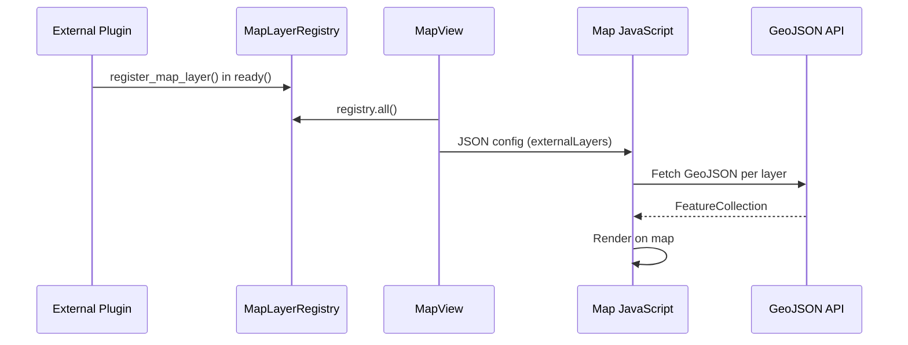

# Map Layer Registry

The Map Layer Registry allows external NetBox plugins to display their data on the Pathways interactive map. This enables cross-plugin visualization — for example, a fiber management plugin can show splice points and cable routes on the infrastructure map.

## Overview

The registry is a Python-side singleton populated during Django's `ready()` phase. Registered layers are serialized to JSON configuration that the map's JavaScript consumes to fetch, render, and style external data.



## Geometry Modes

### URL Mode

The plugin provides its own GeoJSON endpoint. Pathways fetches from the URL and renders the features.

```python
from netbox_pathways.registry import register_map_layer, LayerStyle

register_map_layer(
    name='fiber-cables',
    label='Fiber Cables',
    geometry_type='LineString',
    source='url',
    url='/api/plugins/netbox-fms/geo/fiber-cables/',
    style=LayerStyle(color='#e91e63'),
)
```

### Reference Mode

The plugin's model has a foreign key to a Pathways model (Structure or SiteGeometry). Pathways resolves the geometry automatically and serves GeoJSON at `/api/plugins/pathways/geo/external/<layer_name>/`.

```python
from netbox_pathways.registry import (
    register_map_layer,
    LayerDetail,
    LayerStyle,
)

register_map_layer(
    name='splice-points',
    label='Splice Points',
    geometry_type='Point',
    source='reference',
    queryset=lambda request: SplicePoint.objects.filter(
        structure__site__in=request.user.get_sites()
    ),
    geometry_field='structure',  # FK to netbox_pathways.Structure
    feature_fields=['name', 'splice_type', 'fiber_count', 'status'],
    style=LayerStyle(
        color_field='splice_type',
        color_map={
            'fusion': '#4caf50',
            'mechanical': '#ff9800',
            'connectorized': '#2196f3',
        },
        default_color='#9e9e9e',
    ),
    detail=LayerDetail(
        url_template='/plugins/netbox-fms/splice-points/{id}/',
        fields=['name', 'splice_type', 'fiber_count', 'status', 'structure'],
    ),
)
```

## Supported FK Targets

Reference mode resolves geometry through foreign keys to these models:

| Model | Geometry Column | Geometry Type |
|-------|----------------|---------------|
| `netbox_pathways.Structure` | `location` | Point/Polygon |
| `netbox_pathways.SiteGeometry` | `geometry` | Point/Polygon |

The `geometry_field` parameter names the FK field on your model that points to one of these targets.

## Registration API

### `register_map_layer(**kwargs)`

Register a layer on the Pathways map.

| Parameter | Type | Required | Description |
|-----------|------|----------|-------------|
| `name` | `str` | Yes | Unique layer identifier |
| `label` | `str` | Yes | Display label in layer control |
| `geometry_type` | `str` | Yes | `'Point'`, `'LineString'`, or `'Polygon'` |
| `source` | `str` | Yes | `'url'` or `'reference'` |
| `url` | `str` | URL mode | GeoJSON endpoint URL |
| `queryset` | `Callable` | Reference mode | `(request) -> QuerySet` |
| `geometry_field` | `str` | Reference mode | FK field name to geo model |
| `feature_fields` | `list[str]` | No | Fields to include in GeoJSON properties |
| `style` | `LayerStyle` | No | Visual styling configuration |
| `detail` | `LayerDetail` | No | Sidebar detail panel configuration |
| `popover_fields` | `list[str]` | No | Fields shown on hover (default: `['name']`) |
| `default_visible` | `bool` | No | Show layer by default (default: `False`) |
| `group` | `str` | No | Group label for layer control |
| `min_zoom` | `int` | No | Minimum zoom to fetch data (default: `11`) |
| `max_zoom` | `int` | No | Maximum zoom to fetch data (default: `None`) |
| `sort_order` | `int` | No | Layer ordering (default: `100`) |

### `unregister_map_layer(name)`

Remove a previously registered layer.

### `LayerStyle`

| Parameter | Type | Default | Description |
|-----------|------|---------|-------------|
| `color` | `str` | `'#3388ff'` | Single color for all features |
| `color_field` | `str` | `None` | Property field for categorical coloring |
| `color_map` | `dict` | `None` | `{field_value: color}` mapping |
| `default_color` | `str` | `'#999999'` | Fallback when value not in color_map |
| `icon` | `str` | `None` | MDI icon class (future use) |
| `dash` | `str` | `None` | SVG dash-array for lines |
| `weight` | `int` | `3` | Line weight in pixels |
| `opacity` | `float` | `0.8` | Feature opacity |

**Static styling** (single color for all features):

```python
LayerStyle(color='#e91e63')
```

**Categorical styling** (color based on a property value):

```python
LayerStyle(
    color_field='status',
    color_map={
        'active': '#4caf50',
        'planned': '#ff9800',
        'decommissioned': '#f44336',
    },
    default_color='#9e9e9e',
)
```

### `LayerDetail`

| Parameter | Type | Default | Description |
|-----------|------|---------|-------------|
| `url_template` | `str` | `None` | URL pattern with `{id}` placeholder |
| `fields` | `list[str]` | `[]` | Fields to show in detail panel |
| `label_field` | `str` | `'name'` | Field used as the detail panel title |

## Integration Example

In your plugin's `PluginConfig`:

```python
# netbox_fms/__init__.py
from netbox.plugins import PluginConfig

class FMSConfig(PluginConfig):
    name = 'netbox_fms'
    ...

    def ready(self):
        super().ready()
        from netbox_pathways.registry import (
            register_map_layer,
            LayerDetail,
            LayerStyle,
        )
        from netbox_fms.models import FiberCable, SplicePoint

        register_map_layer(
            name='fiber-cables',
            label='Fiber Cables',
            geometry_type='LineString',
            source='reference',
            queryset=lambda request: FiberCable.objects.all(),
            geometry_field='pathway',
            feature_fields=['name', 'cable_type', 'fiber_count', 'status'],
            style=LayerStyle(
                color_field='cable_type',
                color_map={
                    'single_mode': '#2196f3',
                    'multi_mode': '#ff9800',
                },
                default_color='#9e9e9e',
                weight=4,
            ),
            detail=LayerDetail(
                url_template='/plugins/netbox-fms/fiber-cables/{id}/',
                fields=['name', 'cable_type', 'fiber_count', 'status'],
            ),
            popover_fields=['name', 'cable_type'],
            min_zoom=13,
            sort_order=50,
        )

        register_map_layer(
            name='splice-points',
            label='Splice Points',
            geometry_type='Point',
            source='reference',
            queryset=lambda request: SplicePoint.objects.all(),
            geometry_field='structure',
            feature_fields=['name', 'splice_type', 'fiber_count'],
            style=LayerStyle(
                color_field='splice_type',
                color_map={
                    'fusion': '#4caf50',
                    'mechanical': '#ff9800',
                },
                default_color='#9e9e9e',
            ),
            detail=LayerDetail(
                url_template='/plugins/netbox-fms/splice-points/{id}/',
                fields=['name', 'splice_type', 'fiber_count', 'status'],
            ),
            sort_order=51,
        )
```

## Map Behavior

### Rendering

- **Points** render as circle markers with the configured color
- **Lines** render as polylines with color, weight, dash, and opacity
- **Polygons** render as filled polygons with 20% fill opacity

### Zoom Filtering

Layers only fetch data when the map zoom is between `min_zoom` and `max_zoom`. This prevents overloading the map at low zoom levels.

### Layer Control

Registered layers appear as toggle buttons in the map's layer control. The `label` is used as the button text, and `default_visible` determines the initial state.

### Sidebar Integration

Clicking an external feature opens the sidebar detail panel. If a `detail.url_template` is configured, the panel shows enriched data fetched from that URL. Otherwise, it renders the GeoJSON properties directly.

### Hover Popover

Hovering shows a popover with fields specified in `popover_fields` (defaults to `['name']`).

## Validation

The registry validates registrations and raises `ValueError` for:

- Duplicate layer names
- Invalid `geometry_type` (must be Point, LineString, or Polygon)
- Invalid `source` (must be url or reference)
- Missing `url` for URL mode
- Missing `queryset` or `geometry_field` for reference mode
- `color_field` not present in `feature_fields`

## Permissions

- **URL mode**: The JavaScript fetch includes the session CSRF cookie. The external endpoint must handle its own authentication.
- **Reference mode**: The `queryset` callable receives the Django `request` object, so you can filter by user permissions, site access, or any other criteria.
